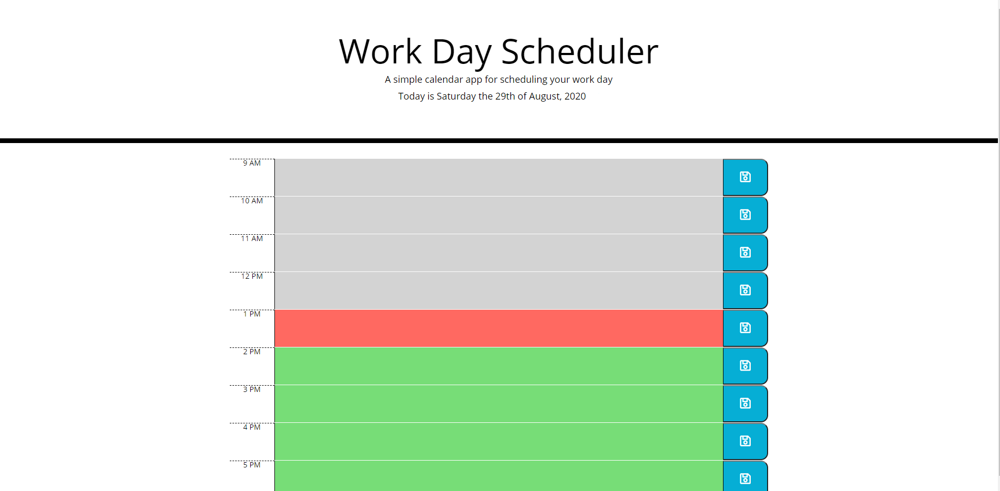
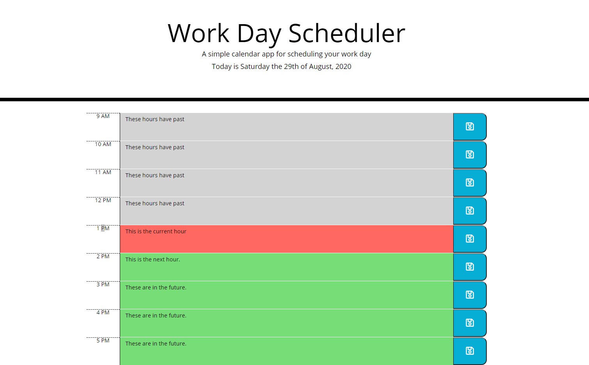

# Work Day Scheduler

## Purpose

A simple calendar app for scheduling your work day

## Features
  * the date at the top updates every ten minutes
  * displays the normal work hours
  * indicates whether the hour
    - has past.
    - is the current time.
    - or the future
  * allows you to enter tasks into the hours form.
  * Saves the task to local storage once entered, and exited.
  * Saves the task when the save button is clicked.
  
## Screenshots
  
  
  This is The app when it is first opened.
  
  This is the app with information Saved.
  
  This is the local storage after saving the information.

## Languages
  * HTML
  * CSS
    - Bootstrap
  * JS
    - jquery
    - moment

## Made By

Josh Miller

### Where to Find it
[This is the repository](https://github.com/sithSlave/day-planner/)
[This is the website](https://sithslave.github.io/day-planner/)

